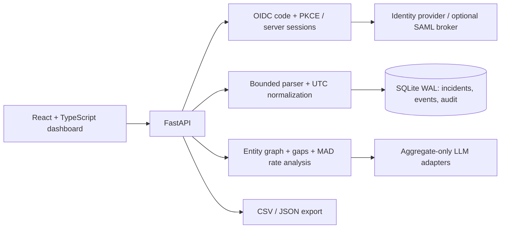

# Incident Timeline Studio — Ryan Vo | AI & Machine Learning

Current version: `1.0.0`.

Incident Timeline Studio helps security analysts turn mixed CSV and JSON logs into a reviewable UTC timeline. It combines explicit timestamp normalization, entity-based temporal correlation, robust event-rate statistics, and optional grounded LLM advice. Every import and analyst decision is recorded, with version checks to prevent lost updates.

## What you can do

- Preview bounded CSV, JSON-array, or JSON-Lines evidence before committing it atomically.
- Normalize explicit offsets, named time zones, and numeric epochs without guessing epoch units or ambiguous daylight-saving times.
- Deduplicate replayed evidence while preserving upload hashes, row hashes, original timestamps, and import receipts.
- Trace correlation edges to their shared entity and exact time difference; inspect source gaps and rate anomalies.
- Mark events relevant or benign, record reasons, close an incident, and export CSV or JSON for review.
- Request local guidance or opt in to external AI advice using only aggregate measurements.

## Architecture



The backend separates authentication, persistence, normalization, entity extraction, analysis, review workflows, advisory adapters, export, and evaluation. All data changes use transactions. The UI uses the actual HTTP routes and keeps session tokens out of browser storage.

## Local installation

Use Python 3.12 and Node 24, matching CI. From the repository root:

```sh
python3 -m venv .venv
.venv/bin/pip install -r backend/requirements.txt
APP_ENV=development AUTH_MODE=demo BIND_HOST=127.0.0.1 COOKIE_SECURE=false FRONTEND_URL=http://127.0.0.1:5173 \
  .venv/bin/uvicorn backend.app.main:create_app --factory --host 127.0.0.1 --port 8019
```

In another terminal:

```sh
cd frontend
npm ci
npm run dev
```

Visit http://127.0.0.1:5173 and choose **Enter local demo**. Create an incident, upload `examples/events.csv`, choose **Preview import**, then **Commit evidence**. Inspect temporal links, record a review decision, and export the timeline. The sample contains fictional documentation-range IP addresses, not captured traffic.

Demo login is restricted to loopback clients and refused in production. The local demo has the admin role. Do not expose a development demo through a public proxy.

## Import contract

Required fields are `timestamp` and `message`. Optional fields are `source`, `severity`, `actor`, `host`, and `ip`. Severity must be `debug`, `info`, `low`, `medium`, `high`, `critical`, or `unknown`.

| Timestamp example | Interpretation |
|---|---|
| `2026-10-09T08:00:00-07:00` | Explicit offset, normalized to UTC |
| `2026-10-09T15:00:00Z` | UTC |
| `2026-10-09T08:00:00` | Interpreted in the selected default IANA time zone |
| `1791558000` | Epoch, using the explicitly selected seconds or milliseconds unit |

Ambiguous or nonexistent local DST times are rejected until the source supplies an explicit offset. Invalid rows prevent the entire commit; valid preview rows are never silently committed around invalid ones. Imports are capped at 5 MiB/10,000 rows, and each incident at 10,000 unique events. The server rechecks deduplication at commit. A replay of the same file returns its existing receipt.

Raw uploaded files are not retained. The upload hash and canonical raw-row hash support provenance comparisons with your original evidence, but do not replace an evidence vault or a forensic chain-of-custody system. Keep source files in your controlled evidence store.

## SSO, roles, and SAML

Production uses OIDC authorization-code login with S256 PKCE. The server verifies the ID-token signature, issuer, audience, expiry, nonce, and authorized party, then issues a revocable HttpOnly session cookie. State is browser-bound and single-use. Mutations require the session's CSRF token. Configure:

- `OIDC_DISCOVERY_URL`: your issuer's `/.well-known/openid-configuration` URL.
- `OIDC_CLIENT_ID` and, if required by a confidential client, `OIDC_CLIENT_SECRET`.
- `OIDC_REDIRECT_URI`: `https://your-host/api/auth/callback`, registered exactly with the provider.
- `FRONTEND_URL`: your public HTTPS origin.
- `OIDC_ROLE_CLAIM`: dotted role-claim path, default `realm_access.roles`.

| Role | Permissions |
|---|---|
| Viewer | Read incidents, analysis, history, and exports |
| Reviewer | Viewer rights plus create/import/review/close/reopen/advice |
| Admin | Reviewer rights plus delete incidents |

This is a **shared analyst workspace**: authorized viewers can read all incidents. It is not a multi-tenant isolation boundary. Unknown role sets default to viewer. Sessions expire after eight hours by default; logout revokes the current server session.

For SAML, connect your enterprise SAML provider to an OIDC broker such as Keycloak, then configure this app against that broker. This app does not accept SAML assertions directly. Protocol-fixture tests cover OIDC claims, PKCE, state replay, CSRF, and authorized writes; your actual enterprise tenant and broker settings must be tested in your environment.

## Docker deployment

Copy `.env.example` to `.env`, replace the production identity and frontend URLs with HTTPS values, and configure the client in your IdP. Then run:

```sh
docker compose up --build -d
```

Compose always selects production OIDC mode. The frontend binds to `127.0.0.1:5173`; place an HTTPS reverse proxy in front of it. The backend is reachable only on the Compose network, and nginx forwards `/api` to it. The named `timeline-data` volume persists SQLite. No demo password or default production account is created. Container builds do not call an LLM or require credentials.

Use one backend process for this SQLite deployment. Back up with SQLite's backup API or stop the service before copying the database. Define a retention policy for logs and analyst notes. Administrators can delete an incident and its events/imports; the deletion audit entry remains. Audit records live in the same database and are not tamper-proof against database administrators. Exported JSON contains evidence and notes, so handle it as sensitive data.

## Optional AI advice

No LLM key is needed for core workflows. `LLM_API_KEY` is the one LLM credential; `LLM_PROVIDER`, `LLM_MODEL`, and `LLM_BASE_URL` are non-secret connection settings.

| Provider | Configuration |
|---|---|
| `openai-compatible` / `openai` | Compatible `/v1` base URL and exposed model ID |
| `anthropic` | Messages API and a model available to your key |
| `gemini` | Generate-content API and an available model |
| `ollama` | Local compatible `/v1` endpoint and installed model; key optional |

External requests happen only when a reviewer clicks **Request external advice**. Only aggregate counts and timing measurements are sent—no raw messages, entity values, incident titles, or review notes. Responses must cite one of the supplied evidence categories. Invalid or unavailable responses fall back to local deterministic guidance with an explicit warning. Advice never executes commands or changes evidence, and a valid citation is not proof that the model's prose is correct.

## AI/ML evaluation

The temporal correlation baseline links adjacent occurrences of the same validated entity within a time window. Event-rate analysis uses median absolute deviation with a documented zero-variance count-scale fallback. Neither algorithm proves causality or maliciousness.

Run the reproducible synthetic benchmark:

```sh
.venv/bin/python -m backend.app.services.evaluation --seed 17 --count 12
```

The generator mixes known campaign chains with independent maintenance on shared hosts. Window selection uses training seeds 17–28; evaluation uses disjoint seeds 10017–10028. No customer logs or external LLM calls are used. For this run, the selected window was 600 seconds; held-out pairwise precision was **0.3571**, recall **1.0**, and F1 **0.5263**. The always-separate baseline had F1 **0.0**. These deliberately reported false positives show why shared infrastructure must be reviewed rather than automatically declared related. The UI default remains a conservative, configurable 300-second window; benchmark tuning does not silently change it.

Limitations: synthetic labels are not a production intrusion-detection benchmark, large components dominate pairwise scores, missing telemetry can split related activity, and shared service accounts/NAT/hosts can connect unrelated activity. The result includes concrete error pairs. Optional LLM advice is not measured by this benchmark.

## Validation and API reference

```sh
.venv/bin/python -m pytest backend/tests -q
cd frontend
npm test
npm run build
```

Tests cover timestamp/DST boundaries, replay-safe imports, atomic failure, cross-incident event IDs, optimistic concurrency, roles, CSRF, OIDC signatures/claims/state, CSV safety, rate-analysis edge cases, and all advisory adapter formats with mocked network responses. CI also builds both containers on standard public-repository runners, without paid APIs or artifact uploads.

Interactive schema: http://127.0.0.1:8019/docs locally. See [API reference](docs/api.md) for routes, request bodies, error codes, and session handling.

Maintained by **Ryan Vo** · [A220man on GitHub](https://github.com/A220man) · [ryandtvo@gmail.com](mailto:ryandtvo@gmail.com)
